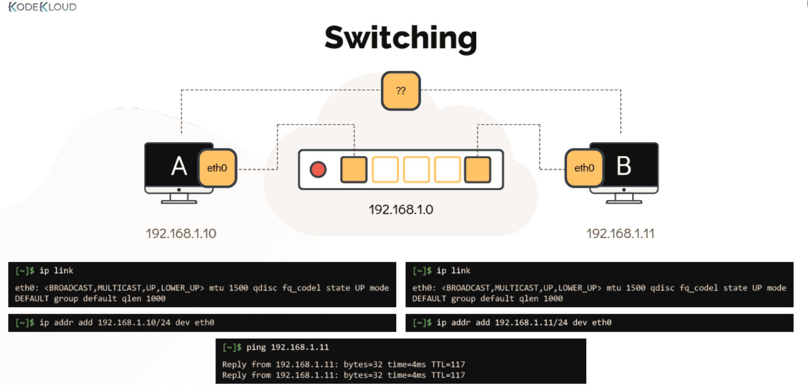
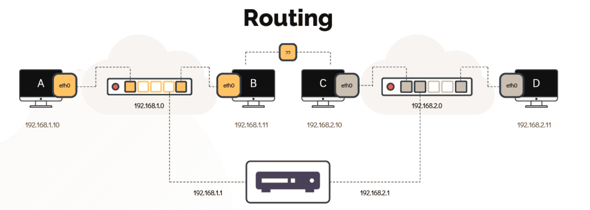

# Switching & Routing 

  - Take me to the [Tutorial](https://kodekloud.com/topic/networking-basics/)

  #### Switching

  - Switching helps to connect the interface within same network.

    

  - To see the interfaces on the hosts use **`ip link`** command

  ```
  [~]$ ip link
  eth0: <BROADCAST,MULTICAST,UP,LOWER_UP> mtu 1500 qdisc fq_codel state UP mode
  DEFAULT group default qlen 1000
  ```

  -  To connect to the switch we use **`ip addr add`** command

  ```
  [~]$ ip addr add 192.168.1.10/24 dev eth0
  ```

  #### Routing

  - Router helps to connect to two seprate networks together.

    

  - To see the existing routing table configuration run the **`route`** command.

  ```
  [~]$ route
  Kernel IP routing table
  Destination Gateway Genmask Flags Metric Ref Use Iface
  ```

  - To configure a gateway on system B to reach the system on other network run

  ```
  [~]$ ip route add 192.168.2.0/24 via 192.168.1.1
  ```
  
  ```
  [~]$ route
  
  Kernel IP routing table
  Destination Gateway Genmask Flags Metric Ref Use Iface
  192.168.2.0 192.168.1.1 255.255.255.0 UG 0 0 0 eth0
  ```

  - To see the ip addresses assign to interfaces use

  ```
  [~]$ ip addr
  ```

  - 

  ```
  [~]$ ip route
  ```

  - To make this changes permanent you must set them in **`/etc/network/interfaces`** file.

# Troubleshooting
  - Check if you are able to connect to the HTTP port 80 on the server `devapp01-web`
  ```
  # tenet to check reachable to port
  tenet devapp01-web 80
  # ping to check reachable to host
  ping devapp01-web
  ```
  - ssh into server and check interface is open
```sh
ssh bob@devapp01-web
ifconfig eth0
# to up the interface
sudo ip link set dev eth0 up
# Add the default route via eth0 gateway.
sudo ip r add default via 172.16.238.1
# To delete the default route using the ip r command, you can use the following command:
sudo ip r del default
```