# Package manager in debian is apt/dpkg

# Package manager in redhat is rpm
### TO Install software available in form of package, like .rpm package to install software in redhat
### rmp command
```sh
rmp -i telnet.rmp   #To Install Package
rmp -e telnet.rpm   # To Uninstal Package
rmp -q telnet.rpm   # Query Package
```
### WHile installing some sofware, we need to install some dependencies to be also install, and while install software using package don't fulfill our requirement.
### Then Package Manager come into picture.
### In Red Hat, `YUM` is a package manager
##### To install software let say for example ansible. Yum search for package repository a wrehouse of tons of software where 1000 of rmp package available. These repo can be available either on our local laptop, on enterprise server of ecure remote localtion.
##### Under the hood, um also used rpm package manager to install sofware, its look for package and its required dependencies
##### Location where Yum look for package metion at `/etc/yum.repos.d`
##### To get the list of repo install in local, run command `yum repolist`
```sh
yum list ansible
yum remove ansible
yum --showduplicates list ansible
```
#### show installed package
```
rpm -qa
rpm -q ansible
```

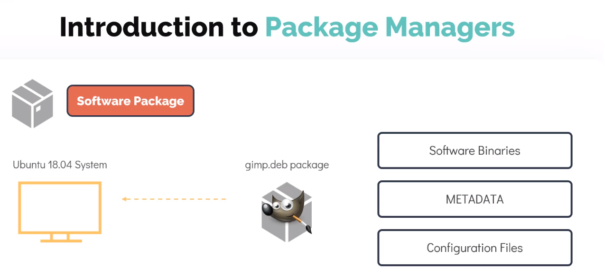

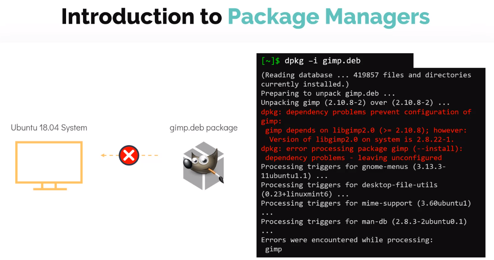

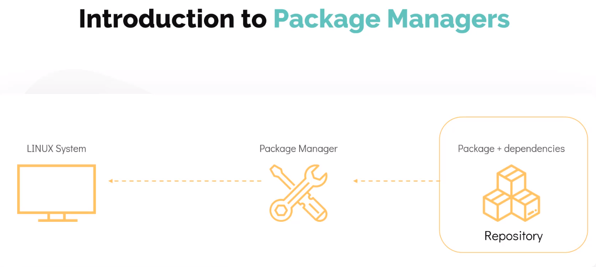


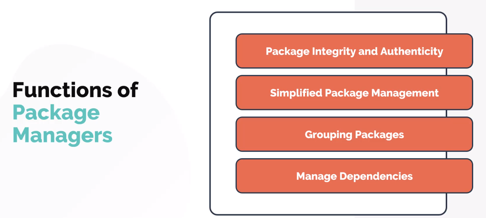

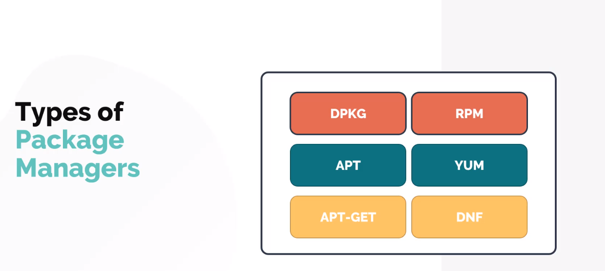

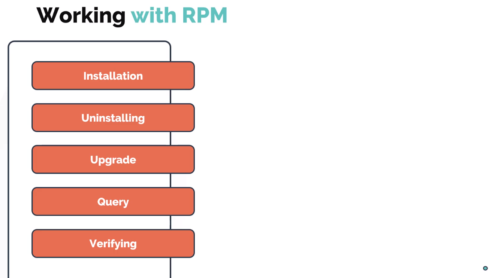

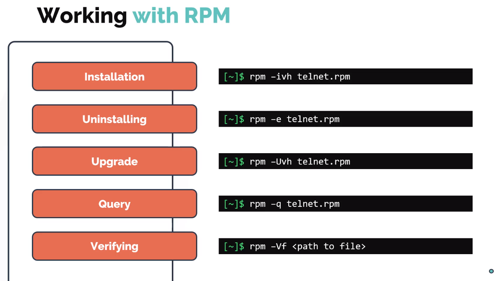

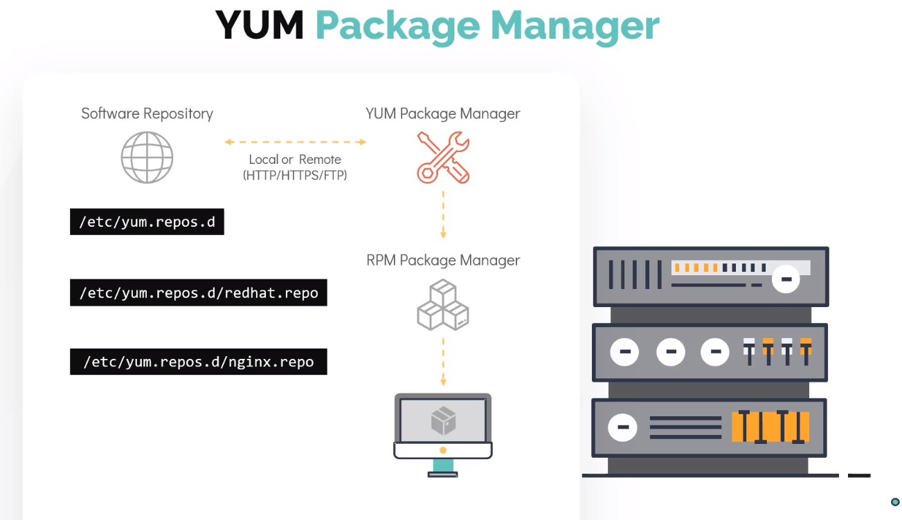

### show all repo added to your system
```
yum repolist
```

### to check which akage provide command
```
yum provides <command>
yum provides scp
```

### to remove
```
yum remove httpd
```

### to update command
```
yum update telnet
```
### to updte alll apckages
```
yum update
```

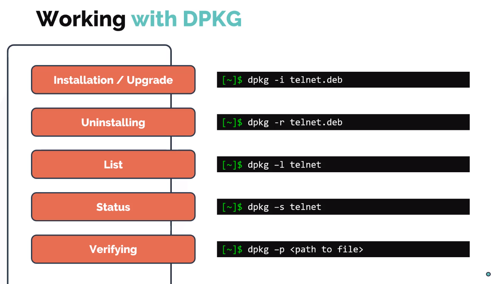

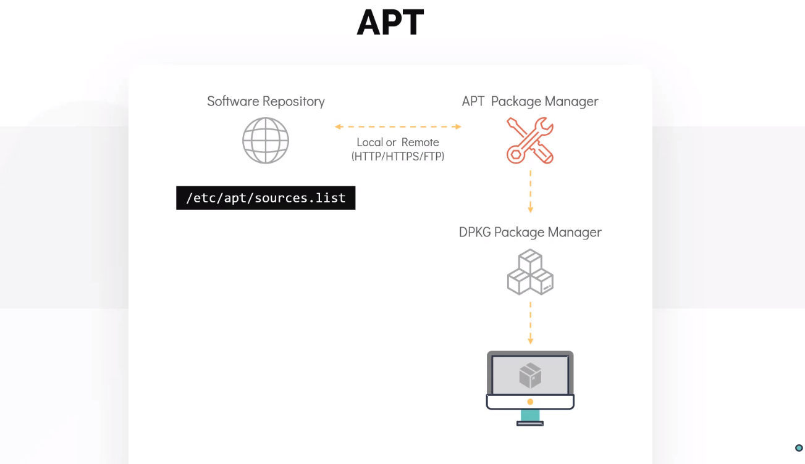


### To refresh repo and this command download package info from all sources
```
apt update  
```

### To upgrdde package
```
apt upgrade
```

### also update 
```
apt edit-sources
```

### Can update the package using updating source.list file


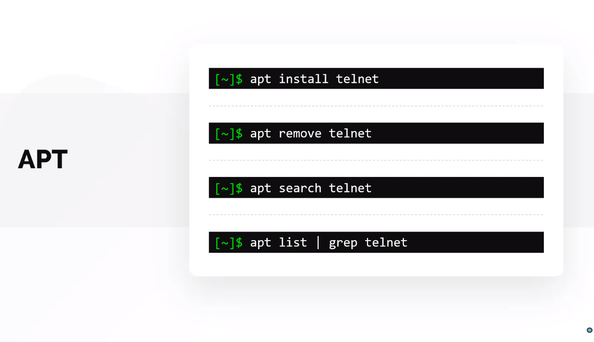
