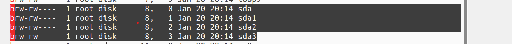
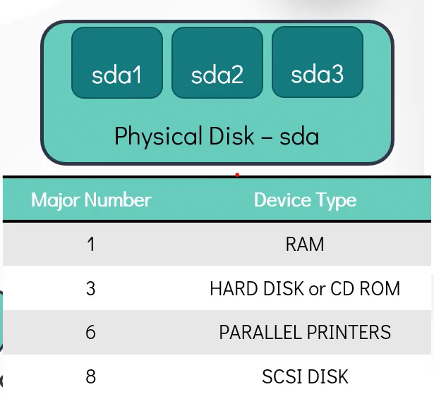
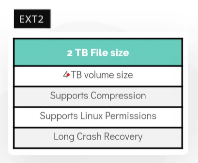
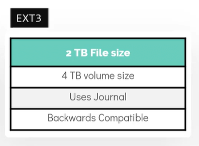
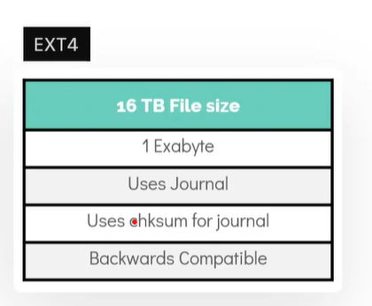
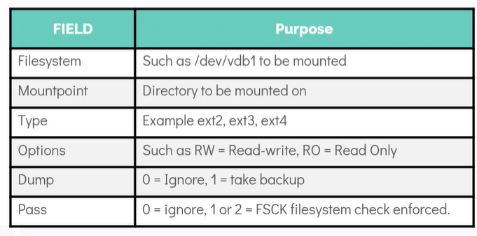
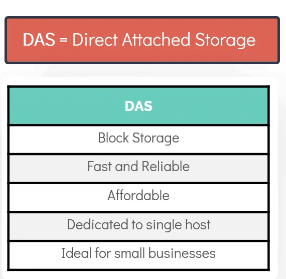
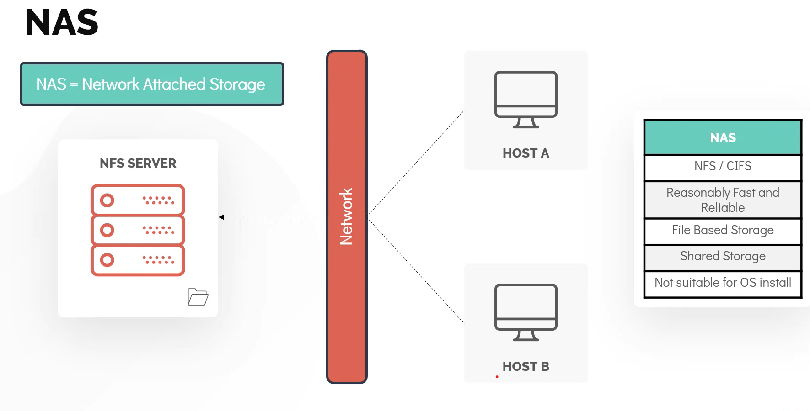
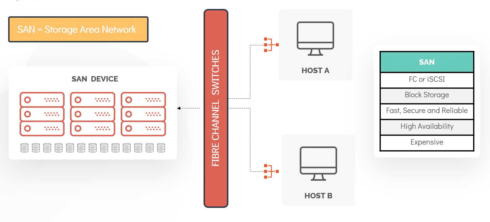

1. Check block staorage in your device
- It found under /dev directory
```
lsblk
```
- To check /dev
```
ls -l /dev/ | grep "^b"

```

- major number = 8, use to identify block device
    - 
- minor number, distuinguish individual logic and physical devices
- List partitiion table information
```
fdisk
sudo fdisk -l /dev/sda
```
2. Partition
- Partition allow to segment space, to different use.
- Three types of Disk Partition
    - Primary: Use to boot OS, limitedd to 4 
    - Extended: 
    - Logical
- Partiton Sceme
    - MBR Master Boot Record, limit to 2TB
    - GUID Partition Table
3. Create Partitiotn
- install gdisk
```sh
sudo apt install -y gdisk
gdisk /dev/sdb
# press ?
press n - add a new partition
press number for number of partion you want, ex 1 
leave first sector size , default 2048 or KMGTP, leave it deafult
enter last sector, size you want, +500M
press w
```
4. File System
- Partitioning alone not make disk usable
- We must create file system to make it usable, otherwise seen by linux kernal as raw
- mount to directory
- Type sof file system
    - ext2 
    - ext3 
    - ext4 
- Create file system
```
mkfs.ext4 /dev/sdb1
mkdir /mnt/ext4
mount /dev/sdb1 /mnt/ext4
# check
mount | grep /dev/sdb1
df -hp | grep /dev/sdb1
# add entry to /etc/fstab
# <file system> <mount point> <type> <option> <dump> <pass>
```

- tocheck type to file system
```
blkid /dev/sdb
```
5. DAS, NAS and SAN
- DAS Direct Attached storage

- NAS Network Attached Storage

- SAN Storage Area Network


6. NFS
Network FIle System

7. LVM
- Logical Volume Manager
- Create LVM
```sh
# Install
apt install -y lvm2
# Create physical volume frist
pvcreate /dev/sdb
# create volume group called caleston_vg, can have one or more PV
vgcreate caleston_vg /dev/sdb
# Display all PV
pvdisplay
# Display VG
vgdisplay
# Create Logical Volume, linear volume
lvcreate -L 1G -n vol1 caleston_vg
# to list logical volume
lvs
lvdisplay
# Create file system
mkfs.ext4 /dev/caleston_vg/vol1
mount -t ext4 /dev/caleston_vg /mnt.vol1

# Resize filesystem of vol1
# check enough space
vgs
# increase by 1GB
lvresize -L +1G -n /dev/caleston_vg/vol1
# Check the size 
df -hP /mnt/vol1
# resize file syatem
resize2fs /dev/caleston_vg/vol1
#Now Check file system size
df -hP /mnt/vol1
```

8. SWAP space
- SWAP space is used when physical memeory is full, it move inactive page to SWAP
- Recommended swap size = twice of size of RAM (if RAM is less than 2G)
- swap size = RAM +  2 (RAM > 2)
- Check memory space
```
free -m
```
- Increae the size of swap
```sh
# take space from disk space
su -
dd if=/dev/zero of=/newswap bs=1M count=1024
# check newspace
cd /
ls -ltr
# adjust permission
chmod go-r /newswap
# make swap
mkswap /newswap
# enable
swapon /newswap
# enable swap during boot time
# specified in fstab
echo "/newswap swap swap defaults 0 0">> /etc/fstab
# to remove
swapoff /newswap
rm -f /newswap
```