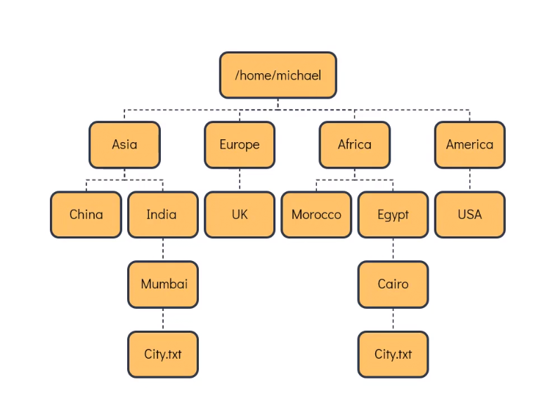

Check the file size

du -sk <filename>

Get file size inhuman readable
du -sh <fileaname>

ls -lh

Archive files
File created by tar is called tarball

tar -c is used to create archive
tar -cf  -f is to specified the name of the tar that should be created
tar -tf is used to see the content of tarball
tar -xf is used to extart content fromtarball
tar -zcf to compress the tarbll to reduce the size

Compressing file
bzip2

gzip

xz

Uncompress
bunzip2

gunzip

unxz 

Locate file
locate <filename>
This command use mlocatedb to search file, to update db run commnd `updatedb`

Find

find /home/raaghib -name city.txt

Grep 

search anyword for example asmple in file name sample.txt

grep sample sample.txt

To make grep case insensetive use 
grep -i

To search a pattern recurssive in directory
grep -r sample /home/raghib

To print all except the pattern
grep -v sample sample.txt

To search a exact word

grep -w sample sample.txt

To print the line atching pattern and one line immediately below

grep -A1 Arsenal premier-league.txt

To print the line atching pattern and one line before

grep -B 1 Arsenal premier-league.txt